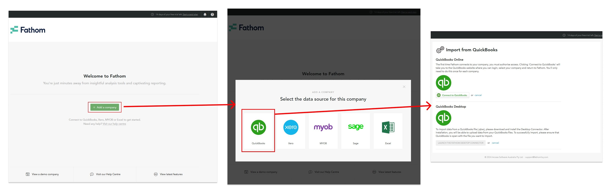

### Date 03/22/2024

1. Job management software
    * [User Access - Employee and Agency](https://help.gohighlevel.com/support/solutions/articles/48000982600-user-access)

2. Accounting software
   * [Setting up QuickBooks Integration](https://help.gohighlevel.com/support/solutions/articles/48001153903-setting-up-quickbooks-integration)

3. Price & Set up payments directly through Go High
    * [Import Products / Price From Stripe](https://help.gohighlevel.com/support/solutions/articles/48001202184-import-products-price-from-stripe)
    * [How to Create and Add Products To a Funnel/ Website (Payments)](https://help.gohighlevel.com/support/solutions/articles/48001204219-how-to-create-and-add-products-to-a-funnel-website-payments-)

### Date 03/22/2024

4. set up automated sms' for membership level
    * Automate SMS using Workflow [How To Build SMS Opt-In Campaigns](https://help.gohighlevel.com/support/solutions/articles/48001170758-how-to-build-sms-opt-in-campaigns)
    * Manual SMS using Workflow [How to set up a Manual SMS action](https://help.gohighlevel.com/support/solutions/articles/48000979921-how-to-set-up-a-manual-sms-action)

5. Date sold
    * [How to use Memberships Revenue Analytics in the CRM?](https://help.gohighlevel.com/support/solutions/articles/48001238746-how-to-use-memberships-revenue-analytics-in-the-crm-)

6. Date Starting
    * [Set Event Start Date Action In Workflows](https://help.gohighlevel.com/support/solutions/articles/48001202723-set-event-start-date-action-in-workflows)

7. Invoice set up in xero Y/N
    * Xero integration is planned in the coming quarter tentatively [link](https://ideas.gohighlevel.com/invoice/p/integrations-with-accounting-platforms-such-as-xero-and-quickbooks-online)

### Date 03/25/2024

8. Fathom connected Y/N
    * GHL to Fathom not available but for [Fathom to Quickbooks Integration](https://www.fathomhq.com/integrations/quickbooks)
    

9. Commissions paid Y/N
    * [Getting Started with the Affiliate Manager (Overview & FAQ)](https://help.gohighlevel.com/support/solutions/articles/48001223169-getting-started-with-the-affiliate-manager-overview-faq-)
